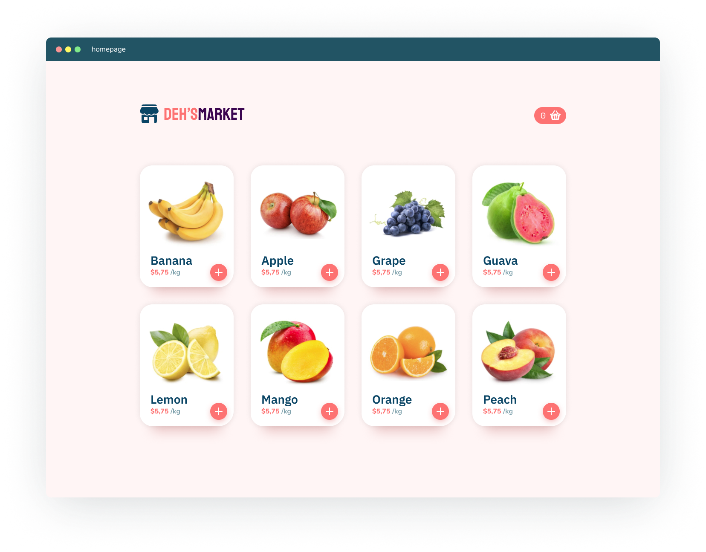
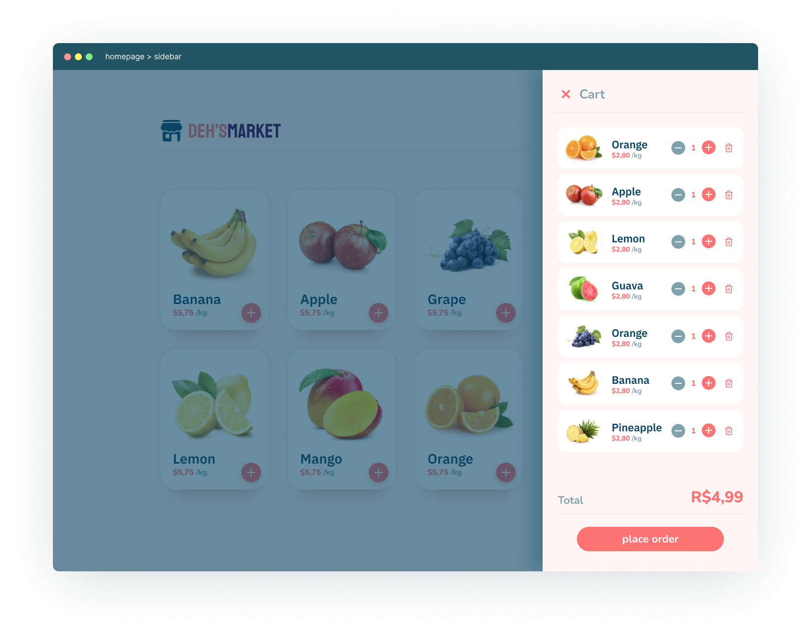
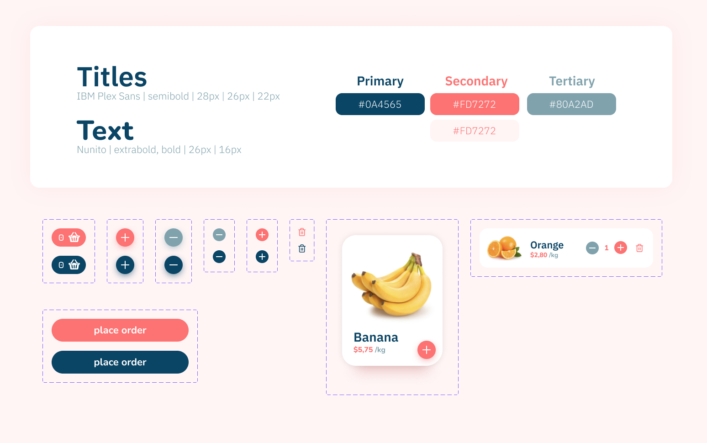

[](https://www.gnu.org/licenses/gpl-3.0)

# Summary

<!--ts-->

- [Purpose](#purpose)
- [Installation](#installation)
- [Content](#content)
- [Using MirageJS](#using-miragejs)
- [Tests Suggestions](#tests-suggestions)
- [Techs and Libs](#techs-and-libs)

<!--te-->

# Purpose

<b>Deh's Market</b> was created to support TDD learning. This application has its styles already done so you can focus on using TDD to implement its functionalities. You can check [tests suggestions](#tests-suggestions) down below.

# Installation

```shell

yarn

// or npm install

```

after installed ...

```shell

yarn dev

// or npm run dev

```

# Content

Feel free to improve and include more complexity. Here's the figma link: https://www.figma.com/file/Ra9QIH91rs3okS9wb6SqIL/deh'smarket?node-id=0%3A1





# Using MirageJS

[MirageJS](https://github.com/miragejs/miragejs) is a client-side server to develop, test and prototype JavaScript apps.

Here it is how we're using [MirageJS](https://github.com/miragejs/miragejs) in our application:

```
├── miragejs
|   ├── products.ts
|   ├── server.ts
```

In the `products.ts` file we have an array with 9 products.

In the `server.ts` we're telling our application to render 9 products by default when it's running in development environment.

<br />

How to config our application to use [MirageJS](https://github.com/miragejs/miragejs):

```typescript
// pages/_app.tsx

import { startMirageServer } from '../miragejs/server'

if (process.env.NODE_ENV === 'development') {
  startMirageServer({ environment: 'development' })
}

function MyApp({ Component, pageProps }: AppProps) {
  // [...]
}
```

<br />

How to use [MirageJS](https://github.com/miragejs/miragejs) in our test files:

```typescript
// test files

import { Server } from 'miragejs'
import { startMirageServer } from '../miragejs/server'

describe('Test Suit', () => {
  let server: Server

  beforeEach(() => {
    server = startMirageServer({ environment: 'test' })
  })

  afterEach(() => {
    server.shutdown()
  })

  it('test with a single product', async () => {
    server.create('product')

    // [...]
  })

  it('test with a list of products', async () => {
    server.createList('product', 3)

    // [...]
  })
})
```

Check out [MirageJS](https://github.com/miragejs/miragejs) documentation for more.

# Tests Suggestions

```typescript
// src/pages/index.tsx

it.todo('should display cart quantity when adding product to cart')
it.todo('should show sidebar when clicking the cart button')
it.todo('should hide sidebar when clicking the close sidebar button')
it.todo('should be able to remove a product from cart')
```

```typescript
// src/hooks/useFetchProducts.tsx

it.todo('should return a list of 3 products')
it.todo('should set error to true when request fails')
```

```typescript
// src/context/cartContext.tsx

it.todo('should be able to add a product')
it.todo('should not be able to add the same product twice')
it.todo('should be able to remove a product')
it.todo("should be able to increase a product's quantity by 1")
it.todo("should be able to decrease a product's quantity by 1")
it.todo("should be able to decrease a product's quantity by 1 but never hit 0")
```

```typescript
// src/components/CartSidebar/index.tsx

it.todo('should render a list of 5 products')
it.todo('update total price based on the added products and their quantities')
```

```typescript
// src/components/ProductAddedToCart/index.tsx

it.todo('should render the product with its info')
it.todo('should be able to increase quantity by 1')
it.todo('should be able to decrease quantity by 1')
```

```typescript
// src/components/ProductCard/index.tsx

it.todo('should render the product card component with product info')
```

```typescript
// src/components/ProductList/index.tsx

it.todo('should render a list of 5 products')
```

# Techs and Libs

- [axios](https://github.com/axios/axios)
- [next](https://github.com/vercel/next.js)
- [react-icons](https://github.com/react-icons/react-icons)
- [styled-components](https://github.com/styled-components/styled-components)
- [jest](https://github.com/facebook/jest)
- [miragejs](https://github.com/miragejs/miragejs)
- [typescript](https://github.com/Microsoft/TypeScript)
